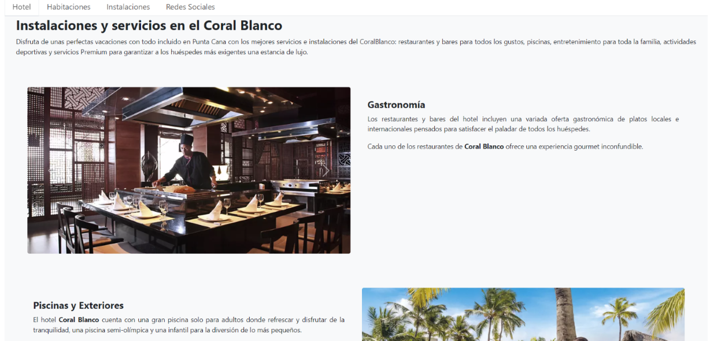
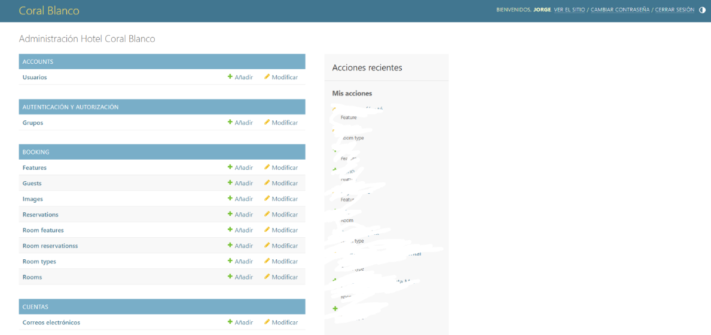

## Coral Blanco - Sistema de reservación hotelera

Bienvenido a nuestro sistema de reservación hotelera en línea, una solución tecnológica que facilita la reserva de habitaciones de un hotel a través de una plataforma web intuitiva. Este proyecto ha sido diseñado para proporcionar a los usuarios una experiencia sin complicaciones al planificar y confirmar sus estancias en el hotel de su elección.

Desarrollado utilizando el lenguaje de programación Python y basado en el robusto framework Django, este sistema ofrece una gama de herramientas poderosas para la creación de aplicaciones web eficientes. La página web resultante permite a los usuarios autenticarse, realizar reservas y acceder a información detallada sobre el hotel, brindando así una experiencia completa y personalizada.

En el aspecto técnico, hemos implementado JavaScript nativo y la popular librería Bootstrap para optimizar la interfaz de usuario y garantizar una experiencia visualmente atractiva. En el backend, utilizamos Django, como base de datos sqlite3 para el desarrollo local y postgresql para la implementación en producción, asegurando una gestión eficiente de los datos y una escalabilidad óptima. Para el proceso de pagos usamos STRIPE, y para el manejo de correos SENDGRID.

Para el administrador, este sistema proporciona funcionalidades avanzadas, permitiéndole generar informes detallados sobre habitaciones, usuarios y reservaciones. En resumen, nuestro sistema de reservación hotelera online ofrece una solución completa y eficiente para la gestión de reservas, mejorando la experiencia tanto para los usuarios como para los administradores del hotel.

## Pantallas

### Home
#### Para el usuario

Si vamos al enlace habitaciones:

#### Home para el admin

Solo cambia la barra negra de arriba, luego todo lo demás es igual.

### Registrarse

#### Correo de confirmación

### Pantalla de Mi Cuenta

#### Mi información

#### Mis reservaciones (si el usuario tiene reservaciones)

### Proceso de reservación

Para que funcione debes estar ingresado, sino te redirige a la pantalla de inicio de sesión.

En esta búsqueda toma como parámetros check-in, check-out, número de adultos y de niños.

#### Resultados de la búsqueda de habitación

Dependiendo de la cantidad de huéspedes y si hay habitaciones disponibles, dependerá cómo se vea esta página. Las que no están disponibles aparece en gris, en este caso dice (esta habitación
no se encuentra disponible) se refiere a que no hay habitaciones de este tipo para reservar en las
fechas indicadas.

##### Si excede la capacidad de huéspedes

Muestra que no se puede reservar ya que excede la capacidad de huéspedes.

##### Si entramos en info, esta sería la pantalla:

#### Pantalla de estadía

Si seleccionamos el botón reservar en una de las habitaciones anteriores, aparecemos en esta pantalla.

#### Pantalla información de contacto

Luego de darle a siguiente paso en la pantalla anterior, aparecemos aquí.

En esta pantalla se agregan los datos del contacto y a la derecha se muestran los detalles de la estadía.

#### Pantalla de confirmar reservación

En esta pantalla se le cobra al usuario la estadía. Debe hacer clic en "pagar con tarjeta" y aparecerá la siguiente pantalla.

#### Pantalla de reservación confirmada

En esta pantalla se muestra un mensaje que verifica que la reservación ocurrió con éxito. En caso
de que no tiraría un error de que el pago no pudo realizarse, o que justamente antes de pagar ya
no hay habitaciones disponibles. El enlace que lleva el identificador nos lleva a la pantalla de
detalle de esa reservación

#### Pantalla de detalle de reservación

#### Correo de confirmación de reservación

### Pantalla de admin

Si accedemos a "Admin", esta sería la pantalla:

#### Obtener reportes

Si en el home vamos a Obtener reportes, aparece esta pantalla.

Los objetos disponibles para hacer reportes serían estos.

#### Reportes

Al hacer clic en "download", se descarga un archivo CSV en nuestra máquina donde podemos ver el reporte.

Tipos de habitaciones:

Reservaciones:

En este ejemplo solo hay una reservación en el sistema

Huéspedes:

Habitaciones:

## Diagrama entidad relación

